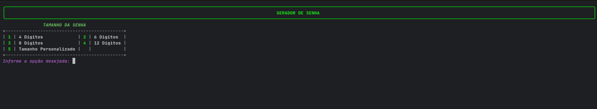
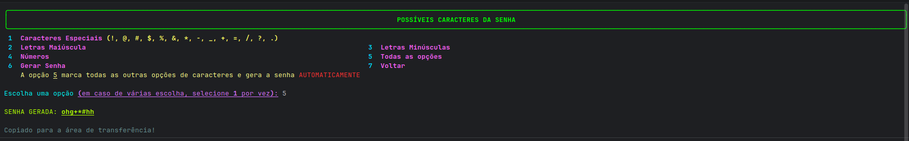

# 🔑 Gerador de Senhas - GenPassword
Gerador de senhas interativo e personalizado com uso de cores e formatações no terminal, desenvolvido em Python. O sistema possui a selecão personalizada de caracteres 
que o usuário pode escolher e após ser gerada, a senha é copiada *automaticamente* para a área de transferência.

## 💡 Funcionalidades
| REQUISITOS | DESCRIÇÃO |
| :--- | :--- |
| RF001 | **Seleção Granular**: Escolha entre letras maiúsculas, minúsculas, números e caracteres especiais ou junções de um ou mais opções |
| RF002 | **Tamanho Customizável**: Defina o comprimento da senha para 4 dígitos, 6 dígitos, 8 dígitos, 12 dígitos ou um tamanho personalizado entre 4 e 100 dígitos |
| RF003 | **Clipboard**: Após ser gerada, a senha é copiada automaticamente para a área de transferência |
| RNF001 | **Personalização de Terminal**: O terminal fica totalmente customizado durante a execução. Menus formatações em negrito, sublinhadas e em itálico; Possuem cores e tabelas para dar destaque para certas informações e organizar as informações na tela|
| RNF002 | **Erros**: Todos os erros que o programa poderia gerar estão devidamente tratados, exibindo mensagem de erro customizada |
| RNF003 | **Confiabilidade**: O sistema utiliza `set()` para que não duplicatas de opções de caracteres que podem gerar uma senha viciada  |
| RN004 | **Modularização**: Os arquivos do sistemas estão modularizados em `main.py`, `erros.py`, `design_cli.py` para manter o código organizado, limpo e facilitar sua eventual manutenção |

## 🛠️ Tecnologias Utilizadas
| Tecnologia | Utilidade |
| :--- | :--- |
| Python | Linguagem de programação usada para criar o algoritmo do gerador |
| PyCharm | IDE utilizada para manipular o python e produzir os arquivos do sistema |
| Git e GitHub | Ferramentas de versionamento do código, hospedagem de repositório e sincronização com ambiente de produção |
| Rich | Lib de python utilizada para personalizar o terminal |
| Pyperclip | Lib de python utilizada para que a senha seja copiada automaticamente para a área de transferência assim que gerada |

## Dependências necessárias
- Linux
  Como o sistema é CLI e utiliza da lib `pyperclip` para copiar a senha, os SO Linux precisa do utilitário `xclip` para copiar textos pelo terminal.
  Sendo assim, para sistemas Linux é necessário realizar essa instalação:
  
  - Debian, Ubuntu, Linux Mint, Kali, Pop!_OS e derivados
    ``` bash
      sudo apt update
      sudo apt install xclip
    ```
  - Fedora, RHEL, CentOS, AlmaLinux, Rocky Linux
    ``` bash
      sudo dnf install xclip
    ```
  - Arch Linux, Manjaro, EndeavourOS
     ``` bash
      sudo pacman -S xclip
    ```
  - openSUSE
    ``` bash
      sudo zypper install xclip
    ```
  - Alpine Linux
    ``` bash
      apk add xclip
    ```
## Processo de instalação 
  1. Clonar o repositório
     ```bash
      git clone https://github.com/lucasmenezes255/gerador_de_senhas.git
     ```
  2. Criar um ambiente virtual dentro da pasta clonada
     ```bash (Linux/Mac)
      python3 -m venv .venv
      source .venv/bin/activate
     ```
     ``` bash (Windows)
      python3 -m venv .venv
      .venv\Scripts\activate
     ```
  3. Instalar as dependências necessárias
     ```bash
       pip install -r requirements.txt
     ```
## Para rodar o programa:
```bash
  python3 main.py
```

## Demonstrações da aplicação
- Menu Inicial - Comprimento da Senha
  
  

- Menu Seleção de Caracteres

  
